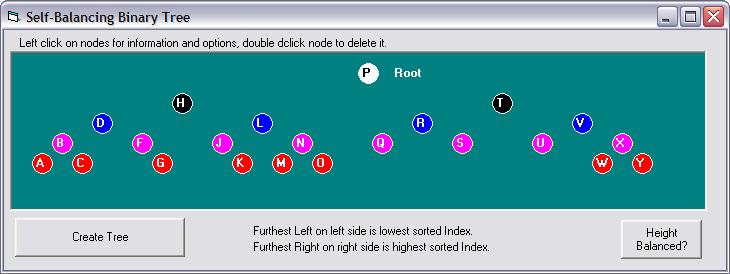



## FYI: Self\-Balancing Binary Tree

### Description

For those that like linked lists, heaps, hash tables, etc, here is a self-balancing binary tree. If you are not familiar with binary trees, I included an RTF document to help understand them. For the rest of us, we know a worse-case binary tree is a linked list, and a best case binary tree is probably a Red-Black or AVL tree. A close runner up is a binary tree that has nodes added randomly, and then a better solution might just be this, a self-balancing binary tree. The tree does not balance perfectly, rather it balances its height on insertions and deletions maintaining a worse-case O(Log n)+1 search time. Not bad at all ;)
 
### More Info
 

             |
---                |---
**Submitted On**   |2008-12-03 19:43:52
**By**             |[LaVolpe](https://github.com/Planet-Source-Code/PSCIndex/blob/master/ByAuthor/lavolpe.md)
**Level**          |Intermediate
**User Rating**    |5.0 (20 globes from 4 users)
**Compatibility**  |VB 5\.0, VB 6\.0
**Category**       |[Data Structures](https://github.com/Planet-Source-Code/PSCIndex/blob/master/ByCategory/data-structures__1-33.md)
**World**          |[Visual Basic](https://github.com/Planet-Source-Code/PSCIndex/blob/master/ByWorld/visual-basic.md)
**Archive File**   |[FYI\_\_Self\-2136101232008\.zip](https://github.com/Planet-Source-Code/lavolpe-fyi-self-balancing-binary-tree__1-71489/archive/master.zip)

